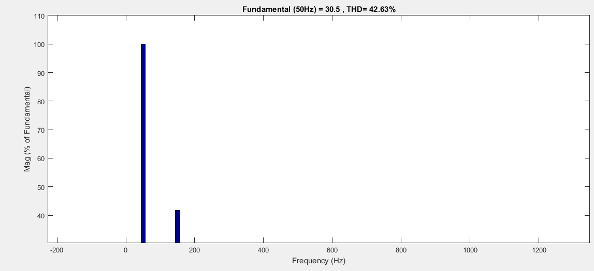
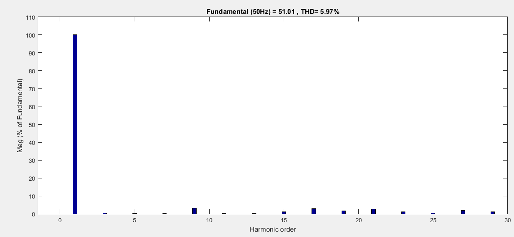

## illustration of method and model

Making a compromise among the solution precision £¬executing efficiency and memory consumption of switching angles required by SHEPWM of the multilevel converter, selective harmonic elimination switching angles rapid generation algorithm is proposed in paper. The algorithm uses neural network to predict the switching angles of iterative initial value, and then switching angles of precise solution are obtained though quasi-Newton algorithm. This hybrid method avoids problem of the look-up table method occupying large memory, and difficulty of accurate switching angles generation based on small scale neural network method. Compared to the look-up table method, data storage space of the algorithm was decreased by 95%. The algorithm execution time is approximately 70ms in STM32F407 board. The experimental results illustrate the generated switching angles can effectively eliminate 5th-, 7th-, 11th-, and 13th-order harmonics and implement selective harmonic elimination while retaining the desired fundamental

### simulation

Modulation is 0.48

  

Modulation is 0.8

   

Modulation is from 0.48 to 0.8 at 0.01s

