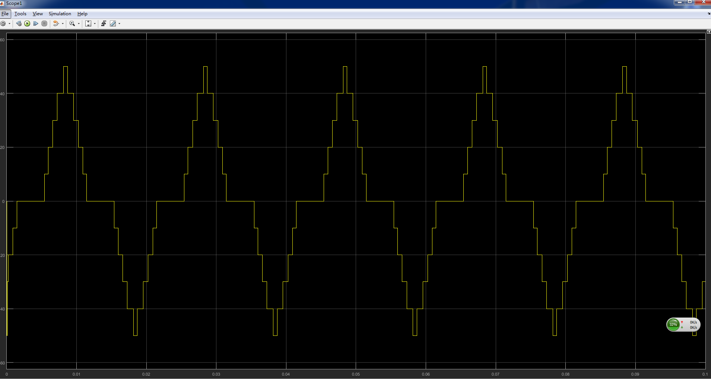
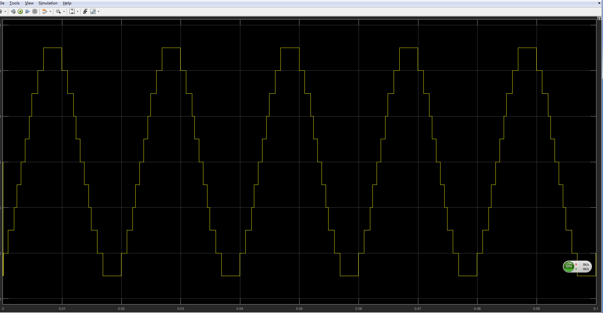
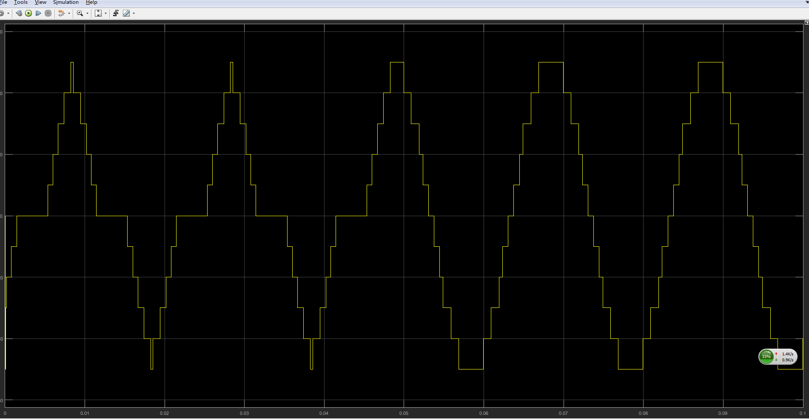

## illustration of method and dodel

SHE switching angles rapid generation algorithm is proposed based on neural network and quasi Newton iteration, which makes a compromise among the memory consumption, executing efficiency and the solution precision. The algorithm uses neural network to predict the switching angles of iterative initial value, and then switching angles of precise solution are obtained though quasi-Newton algorithm. This hybrid method better solves problems of the look-up table method occupying large memory, and small scale neural network method being difficult to achieve precise control. Compared to the look-up table method, data storage space of the algorithm was decreased by 95%. The algorithm execution time is approximately 70ms in STM32F407 board. The experimental results illustrate the generated switching angles can effectively eliminate the target harmonics.

## simulation

